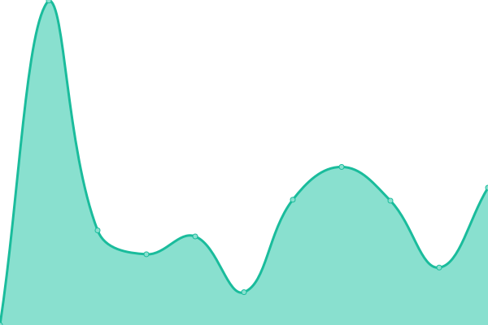
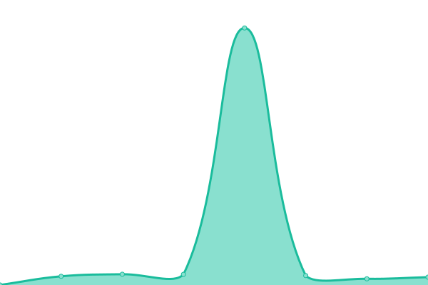

# [📈 Live Status](https://upptime.rtv-apeldoorn.nl): <!--live status--> **🟩 All systems operational**

This repository contains the open-source uptime monitor and status page for [rtvapeldoorn](https://upptime.rtv-apeldoorn.nl), powered by [Upptime](https://github.com/upptime/upptime).

With [Upptime](https://upptime.js.org), you can get your own unlimited and free uptime monitor and status page, powered entirely by a GitHub repository. We use [Issues](https://github.com/rtvapeldoorn/upptime/issues) as incident reports, [Actions](https://github.com/rtvapeldoorn/upptime/actions) as uptime monitors, and [Pages](https://upptime.rtv-apeldoorn.nl) for the status page.

<!--start: status pages-->
<!-- This summary is generated by Upptime (https://github.com/upptime/upptime) -->
<!-- Do not edit this manually, your changes will be overwritten -->
<!-- prettier-ignore -->
| URL | Status | History | Response Time | Uptime |
| --- | ------ | ------- | ------------- | ------ |
|  [Website RTV Apeldoorn](https://www.rtv-apeldoorn.nl) | 🟩 Up | [website-rtv-apeldoorn.yml](https://github.com/rtvapeldoorn/upptime/commits/HEAD/history/website-rtv-apeldoorn.yml) | 

 2639ms
     
 | 

<a href="https://upptime.rtv-apeldoorn.nl/history/website-rtv-apeldoorn">100.00%</a>
    

|  [Streaming Radio RTV Apeldoorn](https://streamingradio.rtv-apeldoorn.nl/login) | 🟩 Up | [streaming-radio-rtv-apeldoorn.yml](https://github.com/rtvapeldoorn/upptime/commits/HEAD/history/streaming-radio-rtv-apeldoorn.yml) | 

 990ms
     
 | 

<a href="https://upptime.rtv-apeldoorn.nl/history/streaming-radio-rtv-apeldoorn">97.17%</a>
    

|  [YouTube kanaal RTV Apeldoorn](https://www.youtube.com/@rtvapeldoorn/videos) | 🟩 Up | [you-tube-kanaal-rtv-apeldoorn.yml](https://github.com/rtvapeldoorn/upptime/commits/HEAD/history/you-tube-kanaal-rtv-apeldoorn.yml) | 

 280ms
     
 | 

<a href="https://upptime.rtv-apeldoorn.nl/history/you-tube-kanaal-rtv-apeldoorn">100.00%</a>
    

|  [RTV Apeldoorn Ticketsysteem](https://storing.rtv-apeldoorn.nl) | 🟩 Up | [rtv-apeldoorn-ticketsysteem.yml](https://github.com/rtvapeldoorn/upptime/commits/HEAD/history/rtv-apeldoorn-ticketsysteem.yml) | 

 1223ms
     
 | 

<a href="https://upptime.rtv-apeldoorn.nl/history/rtv-apeldoorn-ticketsysteem">97.17%</a>
    

|  [RTV Apeldoorn locatiestream](http://95.97.176.18:4000/status.xsl) | 🟩 Up | [rtv-apeldoorn-locatiestream.yml](https://github.com/rtvapeldoorn/upptime/commits/HEAD/history/rtv-apeldoorn-locatiestream.yml) | 

 295ms
     
 | 

<a href="https://upptime.rtv-apeldoorn.nl/history/rtv-apeldoorn-locatiestream">99.78%</a>
    

<!--end: status pages-->

[**Visit our status website →**](https://upptime.rtv-apeldoorn.nl)

## 📄 License

- Powered by: [Upptime](https://github.com/upptime/upptime)
- Code: [MIT](./LICENSE) © [Anand Chowdhary](https://anandchowdhary.com), supported by [Pabio](https://pabio.com)
- Data in the `./history` directory: [Open Database License](https://opendatacommons.org/licenses/odbl/1-0/)
